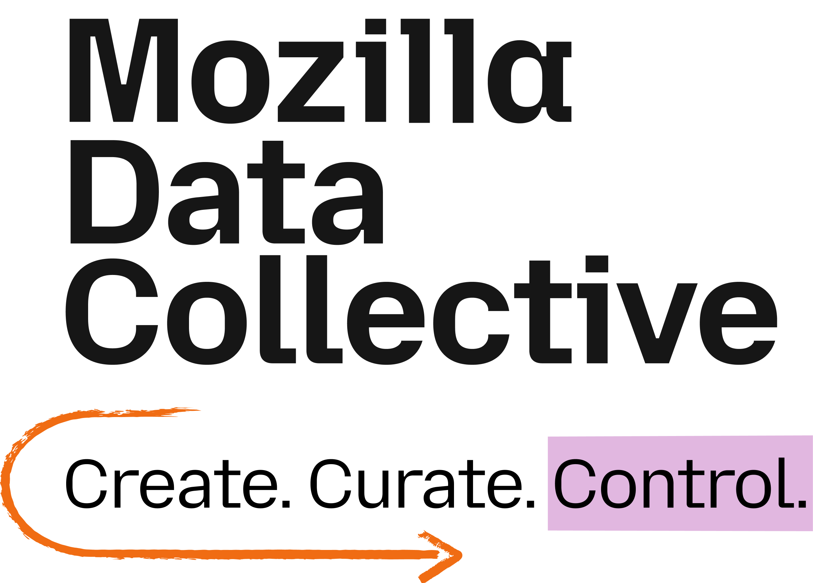

 

# **TidyLang Challenge: Speaker-Controlled Language Recognition**

The **TidyLang Challenge** addresses the critical problem of **language recognition when the same speaker speaks multiple languages**. Language recognition systems are typically evaluated under the assumption that speaker identity is a nuisance variable. However, in realistic multilingual environments, speakers often switch languages across different contexts, creating a risk that models rely on speaker-specific traits (“shortcut learning”) rather than robust linguistic cues.

This challenge uses the **Tidy-X dataset**—the same curated, large-scale multilingual corpus derived from Mozilla Common Voice that emphasizes language switching, with **multi-lingual-per-speaker** data (each speaker contributes utterances in 2–10 languages). Participants will build systems that **disentangle speaker identity from language** and generalize to completely **unseen (zero-shot) languages**. Performance is evaluated on **two tasks**: (1) **Language identification** on **35 seen languages** (training data) — reported as **Macro accuracy**; (2) **Unseen language recognition** on **40 unseen languages** — enrollment-based (20–65 s per enrollment ID, compare with test utterance), reported as **EER**. More detail is given in the [Evaluation Plan]({{ site.baseurl }}/6_evaluation_plan) and [Baseline Systems]({{ site.baseurl }}/7_baseline_systems) pages.

By providing standardized data, open-source baselines, and a rigorous evaluation protocol, this challenge aims to drive research towards trustworthy, identity-invariant, and linguistically grounded language recognition technologies.

 

## Challenge Overview

The TidyLang Challenge is a **Speaker-Controlled and Zero-Shot Language Recognition** challenge. The only permitted data from Mozilla Common Voice is the official **Tidy-X** training and validation partition; all other Common Voice data is strictly forbidden. The core task is **spoken language recognition** at the utterance level under controlled speaker-overlap conditions.

**Evaluation tasks (in both closed- and open-condition):**
- **Task 1 – Language identification (35 seen languages):** Predict the language of each utterance → reported as **Macro accuracy**.
- **Task 2 – Unseen language recognition (40 unseen languages):** Enrollment-based: each enrollment ID has 20–65 s of audio; compare with a test utterance and output a score → reported as **Equal Error Rate (EER)**.

See the [Evaluation Plan]({{ site.baseurl }}/6_evaluation_plan) and [Baseline Systems]({{ site.baseurl }}/7_baseline_systems) for protocols and trial formats.

The challenge uses the **Tidy-X dataset**, a curated partition from Mozilla Common Voice featuring:
- Over 4,474 speakers across 40 languages
- Each speaker with utterances in between 2 and 10 languages
- Approximately 321,711 utterances totaling 457 hours
- Clearly defined training and validation splits (see note below)
- Pseudonymized speaker identities for privacy

**Note on splits:** The training and validation portions used in this challenge are **different from the original splits** of the Tidyvox dataset. Participants **must** follow the official manifest provided in the baseline repository: [training_manifest.txt](https://github.com/areffarhadi/TidyLang2026-baseline/blob/main/data/manifests/training_manifest.txt).

**Evaluation set:** Details about the evaluation data (including size, languages, and trial structure) are **not disclosed** before the evaluation phase to ensure a fair and unbiased benchmark. We will release the evaluation data and the evaluation trial pair lists when the evaluation phase opens.

---

## Evaluation Conditions: Closed vs. Open

Participants can submit to **two conditions**. The same **Common Voice** rule applies to both: **no additional data from the Common Voice dataset** may be used for training beyond the official Tidy-X partition.

### Closed-condition

- **Allowed:** Only the **official Tidy-X training (and validation) data** provided for the challenge.
- **Not allowed:**
  - Any other data from the Common Voice dataset.
  - Any dataset that is **specifically designed for LID** (e.g., NIST LRE, FLEURS, VoxLingua, or similar LID-oriented corpora).

**Goal:** A level playing field so that participants focus on **methodological innovation** (e.g., architecture, training strategy, loss design) rather than extra data.

### Open-condition

- **Allowed:** Still **no** extra Common Voice data. You **may** use **other data that are originally intended for language identification**, including public or private LID-specific datasets (e.g., NIST LRE, FLEURS, VoxLingua, or similar).
- **Not allowed:** Any additional data from the Common Voice dataset.

**Goal:** Explore how much language recognition can be improved in a **general setting** by leveraging additional LID-oriented data (public or private), while keeping the evaluation comparable and the Common Voice boundary clear.

### Foundation models

  <strong style="font-size: 1.1em;">Participants may use foundation models (e.g., Wav2vec2, XLS-R, Whisper, WavLM, etc.) in both conditions;</strong> the data restrictions above apply only to training or adaptation after pretraining, <strong>not</strong> to the model's original pretraining.

### Submission

- **Closed-condition:** Participants **must** submit results for the closed-condition.
- **Open-condition:** Submission is **optional**; participants may additionally submit a system trained under the open-condition rules.

---

## Final Evaluation (per condition)

For **each condition** (closed and, if submitted, open), the **final evaluation** consists of **two tasks**:

1. **Language identification (35 seen languages):** A set of utterances from the 35 training languages. Participants predict the language of each utterance. Results are reported as **Macro accuracy**.
2. **Unseen language recognition (40 unseen languages):** Enrollment-based: each enrollment ID has several files (20–65 s total); each trial is (enrollment ID, test utterance). Participants output a similarity or probability score per trial. Results are reported as **Equal Error Rate (EER)**.

More detail on protocols and trial formats is given in the [Evaluation Plan]({{ site.baseurl }}/6_evaluation_plan). Rankings may be computed per task and/or per condition; details will be given when the evaluation phase opens.

**During validation (development phase):** Both an **identification set** (35 seen languages) and an **enrollment-based verification set** (enrollment IDs + trial file) are provided, so participants can evaluate both tasks locally before the final evaluation phase.

---

## Challenge Phases

**Development Phase:** Participants use the provided **training and validation data** to develop and tune their systems. **Validation** includes both an **identification set** (35 seen languages) and an **enrollment-based verification set**, so you can measure Macro accuracy and EER on the validation data. You can experiment with different approaches, architectures, and hyperparameters using the official Tidy-X splits.

**Evaluation Phase:** When the evaluation phase opens, the evaluation set and submission procedure (including the CodaBench link) will be announced. Participants **must** submit results for the **closed-condition**; **open-condition** submission is optional. Results will be reported for both **language identification** (Macro accuracy) and **unseen language recognition** (EER) in each condition. Rankings will be determined based on performance on the evaluation set.

## Learn More

- **Challenge Description**: [Challenge Description]({{ site.baseurl }}/1_challenge_description)
- **Dataset Download**: [Dataset Download]({{ site.baseurl }}/2_dataset_download)
- **Challenge Task**: [Challenge Task]({{ site.baseurl }}/3_challenge_tracks)
- **Submission Guidelines**: [Submission Guidelines]({{ site.baseurl }}/4_submission_guidelines)
- **Important Dates**: [Important Dates]({{ site.baseurl }}/5_important_dates)
- **Evaluation Plan**: [Evaluation Plan]({{ site.baseurl }}/6_evaluation_plan)
- **Baseline Systems**: [Baseline Systems]({{ site.baseurl }}/7_baseline_systems)
- **Organizers**: [Organizers]({{ site.baseurl }}/8_organizers)
- **Registration**: [Registration]({{ site.baseurl }}/10_registration)

 

## Relevant Links

- [Odyssey 2026](https://odyssey2026.inesc-id.pt/)
- [Mozilla Common Voice](https://datacollective.mozillafoundation.org/datasets/cmihtsewu023so207xot1iqqw)
- **Contact: Aref Farhadipour (aref.farhadipour@uzh.ch)**

 

## Short Description of Image on Main Page

In each speech signal from a single person, we have multiple types of information: the identity of the speaker, the content of the speech, emotional information, language information, etc. In this challenge, we aim to develop systems that, when receiving a speech signal from a human, can **recognize the language** in a way that is **independent of speaker identity**—relying on phonetic and phonotactic cues rather than speaker-specific shortcuts, and generalizing to unseen languages.

*This image was generated and edited using Runway and Qwen-VL models.*

 

## Collaborating Organizations

  

    
  

  

    
  

  

    
  

  

    
  

  

    
  

